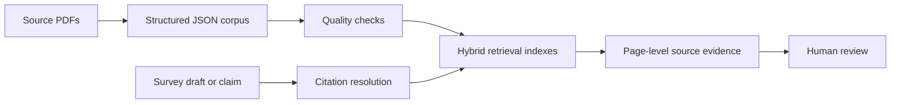

# paper-refcheck

A provenance-aware retrieval tool for auditing quantitative citations in literature surveys.

Writing a survey often requires tracing a cited number, formula, or system
property back to the original paper. This was already tedious manual work; in
the LLM era, it is also harder to trust: a fluent draft can preserve a number
while silently dropping its workload, baseline, unit, or qualifying condition.

`paper-refcheck` is a post-draft evidence-audit tool. It does **not** decide
whether an entire statement is true. It retrieves source-scoped, page-level
evidence for narrow claims—numbers, units, formulas, and system properties—so
that a human reviewer can compare the draft against the cited primary source.

## The problem

A survey claim such as:

> "Colloid achieves 1.01–1.76× speedup [3]."

looks easy to check, but a reviewer still has to:

1. resolve `[3]` in the bibliography;
2. find and open the correct original paper;
3. search for the value despite wording differences;
4. determine whether the number applies under a specific workload, baseline, or
   hardware configuration;
5. record the source page and decide whether the survey preserved the relevant
   condition.

Repeated across dozens of citations, this is slow and error-prone.

LLM-generated drafts make this workflow more important. An LLM may produce a
fluent paragraph that mixes nearby concepts, cites a secondary paraphrase as if
it were a primary source, or retains a number while omitting the conditions that
give that number meaning.

## What this project does



The pipeline:

1. converts source PDFs into structured JSON blocks with document, page,
   section, and bounding-box provenance;
2. checks the extracted corpus for known PDF extraction risks;
3. indexes prose for hybrid retrieval and tables for structured filtering;
4. resolves a draft citation to its registered source paper;
5. retrieves a bounded evidence window from that source;
6. reports the evidence, its location, and a review-oriented verdict.

The original PDF remains the final authority. Structured JSON is a reviewable,
regenerable working corpus. The vector index is only a retrieval accelerator;
it is not the source of truth.

## This is not a replacement for Ctrl+F

If a reviewer already knows the correct paper and exact phrase, Ctrl+F is often
faster and more transparent.

This project automates the workflow around Ctrl+F:

- resolving a citation such as `[9]` to the correct paper;
- searching across a local collection without manually opening each paper;
- handling terminology differences between the draft and source;
- restricting evidence to the cited paper instead of the whole corpus;
- normalizing comparable numeric units;
- returning document, page, section, and source tier;
- surfacing qualifying conditions that may have been omitted;
- handling complete-set table questions with structured filtering.

In short: Ctrl+F finds strings. `paper-refcheck` finds reviewable,
source-scoped evidence for cited quantitative claims.

## Scope

The tool is intentionally narrow.

It is designed for claims that can be reviewed against a small local evidence
window:

- numeric values, units, ratios, and percentages;
- formulas and single-sentence definitions;
- system properties and configuration details;
- table membership and structured comparison facts;
- conditions attached to reported results.

It does **not** attempt to:

- prove that an entire paragraph or paper is true;
- perform open-ended document summarization;
- infer missing experimental context;
- make arithmetic or derived claims not stated in a source;
- replace expert review.

### Atomic claims fit bounded evidence windows

Generic RAG can lose important context when an answer requires reasoning over
many chunks or a whole document. This project avoids that task class.

It focuses on narrow, reviewable claims whose supporting evidence is usually
local to a page or a small number of passages. Retrieval still can miss evidence
because of extraction defects, wording differences, chunk boundaries, or ranking
errors. Therefore results retain page-level provenance and are presented for
human review rather than treated as final judgments.

## Design choices

### Citation scope is part of retrieval

A claim with `[9]` is searched within the paper registered as reference 9. An
uncited claim that appears to paraphrase previous work is searched across
original papers while excluding the survey itself.

This reduces the risk of using a survey's own restatement as evidence for that
same survey. It also avoids the cost and attention dilution of placing an entire
paper collection into an LLM context.

The corpus distinguishes:

- **tier 0**: the survey being audited, which may contain secondhand paraphrases;
- **tier 1**: original papers cited by the survey.

### Tables use structured retrieval

Tables are not treated as ordinary top-*k* vector-search passages.

A question such as "which systems support 2 MB pages?" requires a complete set.
Semantic retrieval may return only the most similar rows and silently omit
others. Parsed tables are therefore queried with deterministic filters over
structured JSON.

### Numeric comparison is deterministic where possible

`units.py` normalizes comparable quantities, allowing checks such as:

```text
54 us == 0.054 ms
```

This avoids relying on a model to perform arithmetic or unit conversion.

### PDF extraction is treated as an evidence risk

Academic PDFs can fail silently because of double-column reading order, table
structure, formulas, superscripts, and font encodings.

The pipeline includes quality checks for conditions such as:

- malformed or misencoded units;
- incomplete or ragged table rows;
- paragraph splits;
- possible layout-order issues;
- low text coverage.

Flagged content is routed for review rather than silently treated as reliable
evidence.

## Workflows

### Search a local paper collection

```bash
python3 refcheck.py
```

```text
> how much does a page migration cost
> /doc m5
> sparse page word level tracking
> /tier 1
> /tables 2mb
```

Prose retrieval combines dense retrieval, BM25, reciprocal-rank fusion, and an
optional reranker. Results can be limited to a document or provenance tier.

### Audit claims in a draft

```bash
python3 check.py --text "Colloid achieves 1.01-1.76x speedup [3]."
```

`check.py`:

1. extracts reviewable claims;
2. resolves citations through `corpus.yaml`;
3. retrieves evidence from the cited source;
4. records page-level evidence and a review signal.

Possible review signals include:

- `supported`
- `condition_mismatch`
- `contradicted`
- `not_found`
- `underspecified`
- `possibly_missing_citation`
- `unresolvable_reference`

These are not final truth labels. They prioritize what a human author should
inspect next.

### Ask a narrow, grounded question

```bash
python3 ask.py "What migration penalty does TierLab use?"
```

The optional answer layer receives retrieved evidence only and resolves source
markers to document, page, and section metadata in application code.

## Example: preserving conditions, not only numbers

Survey claim:

> "Colloid achieves 1.01–1.76× speedup [3]."

The original paper reports that range, but under specific conditions, including
alternate-tier latency and workload context.

The appropriate output is not simply "correct" or "incorrect":

```text
condition_mismatch

The reported range appears in the cited source, but the survey omits conditions
attached to that result.
```

The reviewer can then inspect the original page directly.

## Repository map

| File | Purpose |
|---|---|
| `corpus.py` | Corpus registry, validation, and bootstrap workflow |
| `corpus.yaml` | Citation references, document IDs, tiers, and file paths |
| `checks.yaml` | Corpus-specific acceptance expectations for the index/retrieval self-tests |
| `parse.py` | Coordinate-aware PDF extraction |
| `quality_check.py` | Rule-based extraction-quality checks |
| `vision_verify.py` | Optional rendered-page verification |
| `build_index.py` | Prose, table, and formula artifact construction |
| `retrieve.py` | Hybrid retrieval, reranking, and provenance filters |
| `llm.py` | Model-provider abstraction shared by `ask.py`, `check.py`, and `vision_verify.py` |
| `ask.py` | Narrow grounded question answering |
| `check.py` | Citation-scoped quantitative claim audit |
| `refcheck.py` | Interactive session for repeated lookup/audit queries |
| `units.py` | Deterministic unit normalization |
| `eval/` | Hand-annotated evaluation set and comparison harness |
| `results.md` | Measurements, known defects, and limitations |
| `requirements.txt` | Pinned third-party dependencies |

## Running the pipeline

Source PDFs are supplied locally and registered in `corpus.yaml`.

```bash
# PDFs -> structured JSON blocks
python3 parse.py

# Inspect extraction quality
python3 quality_check.py

# Build indexes and run index acceptance checks
python3 build_index.py --selftest

# Run retrieval acceptance checks
python3 retrieve.py --acceptance

# Validate the hand-annotated evaluation set
python3 eval/validate_eval_set.py
```

The extraction, indexing, structured table retrieval, and deterministic
validation layers run locally without an API key.

The optional generation and claim-adjudication layers require a configured
provider:

```bash
export DEEPSEEK_API_KEY=...
python3 ask.py "What migration penalty does TierLab use?"
python3 check.py --file draft.docx
```

## Measured pipeline acceptance checks

The results below are deterministic pipeline acceptance tests, not LLM accuracy
benchmarks. They verify that extraction, indexing, provenance filters, and
structured retrieval behave as intended on the current corpus.

Current corpus:

| Item | Count |
|---|---:|
| Documents | 13 |
| Pages | 216 |
| Extracted blocks | 8,529 |
| Prose chunks | 1,238 |
| Structured tables | 88 |
| Formulas | 11 |

Measured checks include:

- all 13 rows in the survey's main comparison table reconstructed correctly;
- a structured query for 2 MB page support returned all expected systems:
  `MTM`, `NOMAD`, and `NeoMem`;
- a document filter constrained all top 8 results to the requested paper;
- excluding tier 0 removed the survey from retrieval results;
- quality checks flagged 74 pages for visual review.

See [`results.md`](results.md) for methodology, measurements, known extraction
defects, and limitations.

## Evaluation status

The repository includes a hand-annotated evaluation set covering answerable
claims, refusal cases, attribution traps, numeric checks, and condition
mismatches.

A three-arm LLM experiment is implemented but not yet reported:

1. no retrieval;
2. raw retrieval over unfiltered PDF text;
3. provenance-aware retrieval in this system.

The deterministic acceptance tests above should not be interpreted as an LLM
accuracy benchmark.

## Data availability

The source PDFs are copyrighted conference papers and are not redistributed in
this repository. They must be obtained separately and registered locally.

Derived artifacts—including extracted blocks, vector indexes, page images, and
quality reports—are excluded from version control because they can be regenerated
from the local corpus.

## Known limitations

- PDF text extraction can be wrong even when it looks plausible.
- Some units in the current corpus are misencoded in the PDF text layer and
  require rendered-page review before absence conclusions are trusted.
- Retrieval can miss relevant evidence.
- The tool is designed to support human review, not to replace it.
- The end-to-end LLM comparison has not yet been run.

For details, see [`results.md`](results.md).
